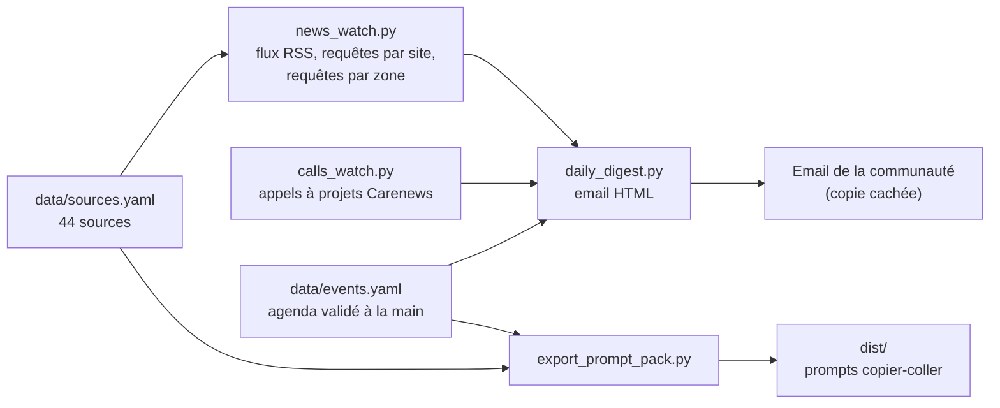

# veille-nif – Veille Nature in Finance

Outil de veille sur la finance durable, axe nature et biodiversité, pour la communauté Nature in Finance. Périmètre : France, Europe, Suisse, Royaume-Uni, avec quelques références internationales (TNFD, ISSB, CBD, IPBES).

Il produit trois choses :
1. **Un email quotidien** : nouveautés, agenda des 60 prochains jours, appels à projets ouverts.
2. **Des versions « copier-coller »** pour Claude, ChatGPT ou tout autre assistant (`dist/`).
3. **Une mini-formation en visio** de 1 h 30 sur l’utilisation de la veille et de l’IA (`formation/`).

Tout tourne gratuitement : du Python sans appel à un modèle d’IA, exécuté chaque jour par GitHub Actions.

## Comment ça marche



- **Actualités** (`src/news_watch.py`) : trois canaux. Les flux RSS des sources qui en ont un ; une requête Google News `site:` pour les autres ; des requêtes thématiques par zone et par langue. Les articles sont filtrés par mots-clés (nature, biodiversité, TNFD, etc.), dédoublonnés et étiquetés par pays et par thème.
- **Agenda** (`src/events_watch.py`) : lit `data/events.yaml`, un agenda tenu à la main. Aucun événement n’y entre sans vérification sur une source officielle. Le script cherche aussi des événements candidats, écrits dans `data/interim/events_candidates.csv` pour relecture, jamais dans l’agenda.
- **Appels à projets** (`src/calls_watch.py`) : lit la liste publique de Carenews, filtre sur la nature et l’agriculture, signale les appels nouveaux ou qui se clôturent sous 14 jours.
- **Email** (`src/daily_digest.py`) : assemble les trois blocs. Un email part s’il y a du nouveau ; l’état de déduplication n’est enregistré qu’après un envoi réussi.

## Installation locale

Python 3.12 ou plus récent. Utiliser un environnement virtuel.

```bash
python3 -m venv .venv
.venv/bin/pip install -r requirements.txt
.venv/bin/python -m unittest discover -s tests -v          # tests, hors réseau
.venv/bin/python src/daily_digest.py --dry-run --html-out veille.html   # aperçu sans rien envoyer ni enregistrer
```

Autres commandes utiles :

- `python src/news_watch.py --check-sources` : vérifie que chaque source et chaque flux répond.
- `python src/events_watch.py` : affiche l’agenda des 60 prochains jours ; `--check-links` vérifie les liens ; `--candidates` cherche des événements à valider.
- `python src/calls_watch.py` : affiche les appels à projets ouverts retenus.
- `python src/export_prompt_pack.py` : régénère les fichiers de `dist/`.

## Mise en route de l’envoi automatique

1. Dans GitHub, **Settings > Secrets and variables > Actions**, créer les secrets suivants. Aucun n’est dans le dépôt, qui est public.
   - `DIGEST_FROM` : la boîte d’expédition.
   - `DIGEST_TO` : les destinataires de la communauté, séparés par des virgules. Ils sont toujours en copie cachée.
   - Pour Microsoft 365 : `GRAPH_TENANT_ID`, `GRAPH_CLIENT_ID`, `GRAPH_CLIENT_SECRET` (permission applicative `Mail.Send`, idéalement restreinte à la boîte d’expédition).
   - Pour un SMTP classique : `EMAIL_BACKEND=smtp`, `SMTP_HOST`, `SMTP_PORT`, `SMTP_USER`, `SMTP_PASSWORD`.
2. Lancer le workflow **Veille quotidienne** à la main (onglet Actions > Run workflow) avec `dry_run` coché, pour vérifier la collecte sans envoyer d’email.
3. Lancer une première exécution réelle avec `lookback_days = 7` et `force_send` coché, puis laisser le planificateur reprendre : 05:00 UTC chaque jour.

Pour changer d’adresse d’expédition, modifier uniquement le secret `DIGEST_FROM` (et l’application Graph si besoin) : aucun changement de code.

Point de vigilance : GitHub désactive les workflows planifiés d’un dépôt public resté 60 jours sans activité. Le workflow écrit chaque jour `data/last_run.txt` et le committe, ce qui crée de l’activité tant que la veille tourne. Si l’exécution échoue plusieurs jours de suite, GitHub envoie un email : ne pas laisser un échec s’installer.

## Ajouter une source

Ouvrir `data/sources.yaml`, copier une ligne, renseigner `rss` si un flux valide existe, sinon `domaine` (requête Google News `site:`). Le champ `filtre` vaut `aucun` pour une source spécialisée, `mots_cles` pour une source généraliste, `mots_cles_large` pour les fonds et fondations. Lancer ensuite `python src/news_watch.py --check-sources`.

## Ajouter un événement

Ouvrir `data/events.yaml`, copier un bloc, renseigner tous les champs obligatoires, dont `source` (la page officielle consultée) et `verifie_le`. Si une information vient d’une source secondaire ou est déduite, mettre `confiance: moyenne` : l’email affichera « à revérifier ». Le chargement valide le fichier et signale toute erreur de saisie.

## Utiliser la version copier-coller

- `dist/prompt_autonome.md` : à coller dans un assistant qui sait chercher sur le web. Il demande une veille sur 7 jours, un agenda à 60 jours et les appels à projets, avec des garde-fous (pas d’invention, « Rien de vérifié trouvé » plutôt qu’une section remplie de mémoire).
- `dist/pack_avec_pieces_jointes.md` : pour un assistant sans accès au web. Même consigne, avec en pièces jointes les sources, l’agenda, les appels à projets ouverts et les actualités récentes détectées.

Dans les deux cas, vérifier les liens avant de citer une information.

## Mini-formation

Dossier `formation/` : fiche programme (`programme.md`), plan des diapositives avec notes et sources (`support.md`), exercices et corrigés (`exercices.md`). Les faits cités ont été vérifiés sur sources primaires le 7 octobre 2026 ; la fiche de vérification du formateur indique quoi revérifier avant chaque séance.

## Limites connues

- Google News trie par pertinence et non par date, et ses requêtes bruitent parfois les résultats ; les filtres par mots-clés réduisent ce bruit sans le supprimer. Les liens des articles passent par une redirection Google.
- Les articles issus des requêtes par zone sont classés par édition de recherche, pas par pays de la source : ils figurent donc sous « Presse et veille thématique » et non sous un pays.
- La lecture de Carenews dépend de la structure HTML de sa page. Si elle change, l’email le signale (« Source Carenews indisponible ») au lieu de masquer la panne.
- L’agenda est tenu à la main : il est fiable mais incomplet. Aucun événement suisse spécifique à la finance et à la nature n’y figure encore dans les 60 prochains jours, à part Building Bridges (Genève, jusqu’au 8 octobre 2026).

## Licence

Deux licences, selon la nature du fichier. Titulaire des droits : fidestra.

- **Code** – licence MIT (`LICENSE`) : `src/`, `tests/`, `.github/`, `requirements.txt`. Réutilisation libre, y compris commerciale, en conservant l’avis de copyright.
- **Contenus et données** – licence CC BY 4.0 (`LICENSE-CONTENT`) : `formation/`, `dist/`, `data/`, `README.md` et les autres textes. Réutilisation libre, y compris commerciale et modifiée, à condition de citer la source et de signaler les modifications.

Attribution demandée pour les contenus :

> Veille Nature in Finance – fidestra, CC BY 4.0, https://github.com/eplr/veille-nif

Les contenus de tiers cités ou liés depuis le dépôt (articles de presse, textes réglementaires, pages d’événements, appels à projets) restent soumis à leurs propres conditions : ces licences ne portent que sur ce qui est produit dans le cadre du projet.

En contribuant, vous acceptez que votre apport soit diffusé sous la licence correspondant au fichier modifié.
